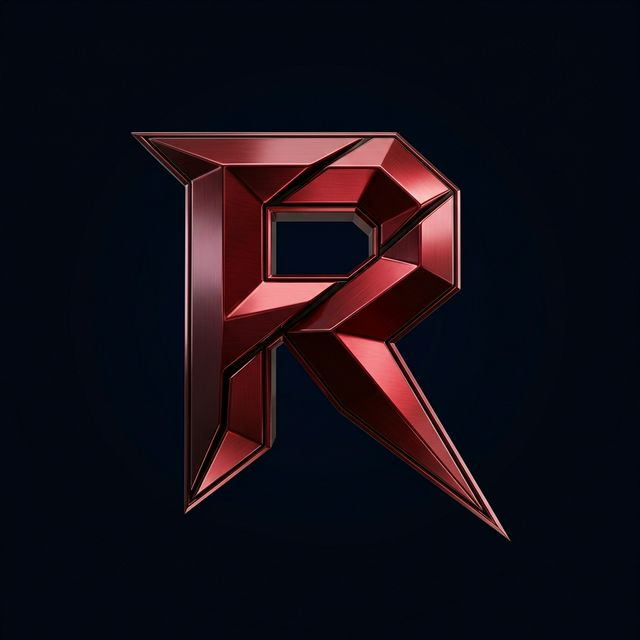
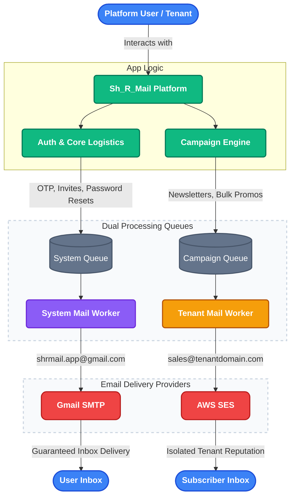
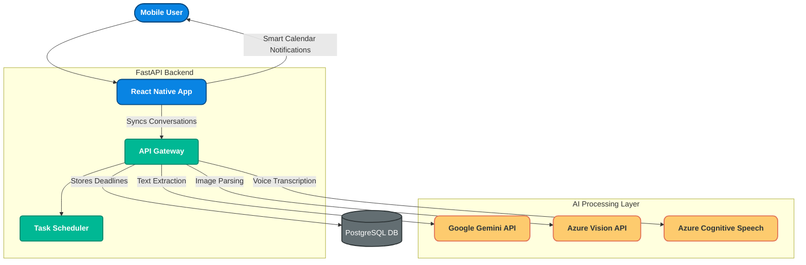

  
  <h1>Rahul Pamula</h1>
  
<b>Software Developer | Cloud Architecture | AI Integration</b>

  
    
  
  
  
  
  

---

## 👨‍💻 About Me

Welcome to my portfolio space! I am a Software Developer who thrives on complex logic and architecture. When a problem is difficult, my interest peaks. I specialize in building complete full-stack ecosystems—from highly polished frontends to deeply integrated API backends, scalable message queues, and cutting-edge **RAG (Retrieval-Augmented Generation) Systems**.

**Hobbies:** Playing chess ♟️ & Mobile gaming 🎮

---

## 🛠️ My Tech Stack

* **Languages & Frameworks:** Python, Node.js, React Native, React, Next.js, FastAPI, TypeScript
* **Infrastructure & AI:** AWS SES, RabbitMQ, Supabase, PostgreSQL, Azure AI Services, Google Gemini, **RAG Systems**
* **Design & UI:** Tailwind CSS, shadcn-ui

---

## 🚀 Major Projects & Architectures

### 1. 📧 [Sh_R_Mail](https://github.com/Rahul-pamula/Sh_R_Mail)
A self-hosted, multi-tenant email marketing and campaign management platform. Built to route massive scales of emails reliably using background workers and AWS SES.

<b>View Architecture Flow</b>

 

### 2. 📱 [Chatnalyxer](https://github.com/Rahul-pamula/chatnalyxer)
An AI-powered mobile app that automatically extracts events and deadlines directly from WhatsApp messages using NLP and Multi-Modal integrations.

<b>View Architecture Flow</b>

 

### 3. ✂️ [Tailoring](https://github.com/Rahul-pamula/tailoring)
A highly polished, modern frontend architecture. Uses Vite, TypeScript, React, and Tailwind CSS to craft a premium user interface.

---

  <i>"I build resilient systems and beautiful interfaces."</i>

